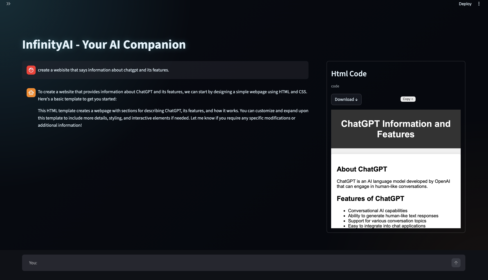
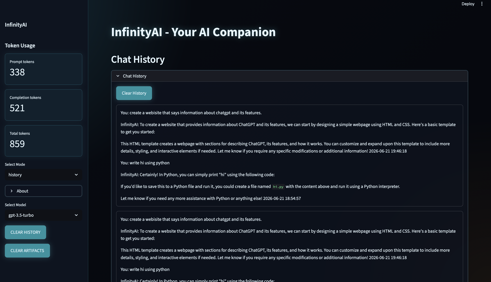
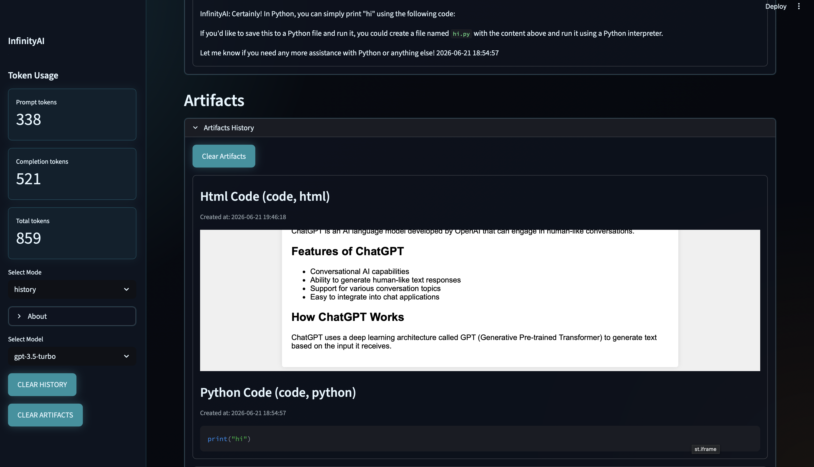

# InfinityAI

An AI-powered artifact workspace for creating, saving, previewing, and reopening code, webpages, and documents.

## Try-it-out

- [Try InfinityAI](https://infinityai.app)

# What is InfinityAI?

InfinityAI is an AI-powered built with css and streamlit. It converts AI responses into structured Canvas artifacts such as code, webpages, scripts, and documents. Artifacts are stored locally in SQLite so you can reopen, preview, copy, download, and manage their previous work.

## Why I built this?

This is inspired from chatGPT's canvas feature. I tried to make it better by adding more features such as history and stay consistent with the same workspace. I also wanted to make it more interactive and user-friendly.

The problem with chatGPT's canvas is that it doesn't have a history feature, so you can't reopen your previous work. Also, it doesn't have a preview feature, so you can't see the output of your code or webpage before downloading it. It also is beta and constanly gets moved around, so I wanted to create a more stable and consistent workspace for users.

## Features

- HTML and Markdown previews
- Syntax-highlighted code
- Copy and download controls
- Local SQLite conversation history
- Token usage tracking and limits
- Custom Streamlit interface

## AI USAGE

I used AI to structure the CSS and write the system prompt.

## History

