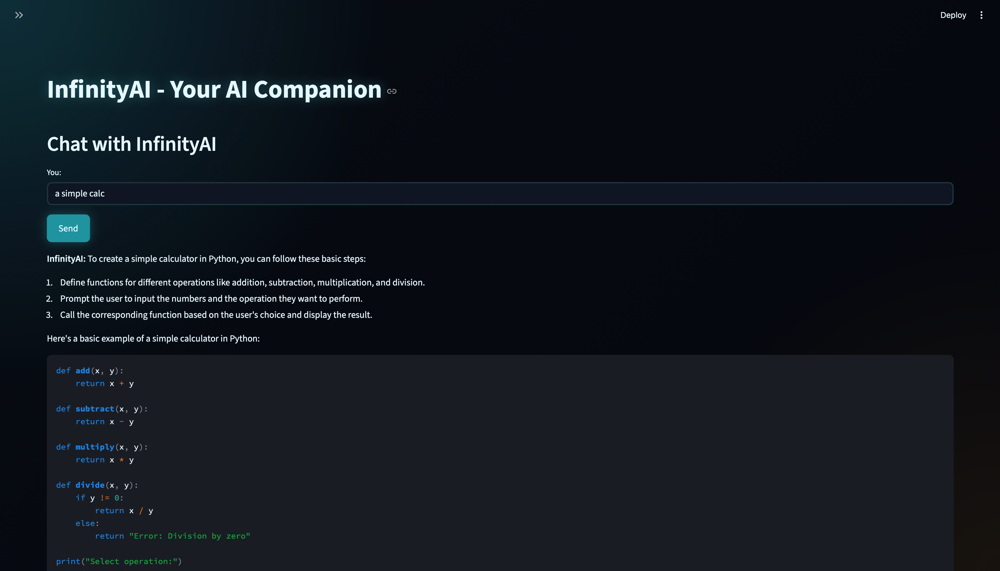

## Day 2 (Thursday, May 21)

Today, I focused on removing dead code, adding error handling, and adding a token usage counter to the sidebar. I wrote css to style the app and injected it as the start of the app but it was still not working so I was stuck there for a while, then figured that it hapend because of syntax(obivously) and fixed it. I also added a check to make sure the css file is loading correctly. I fixed it eventually and the first prototype of the app look decent and clean but I thought it could look a lot better so I spent the rest of the day improving UI/UX by adding custom fonts, styled chat bubbles, and a custom background. I also added a spinner to show when the AI is generating a response and made the token usage and cost more visible in the sidebar. It is now looking fire, just look at it.

I am still working on to make the loading animation look perfect and good. 